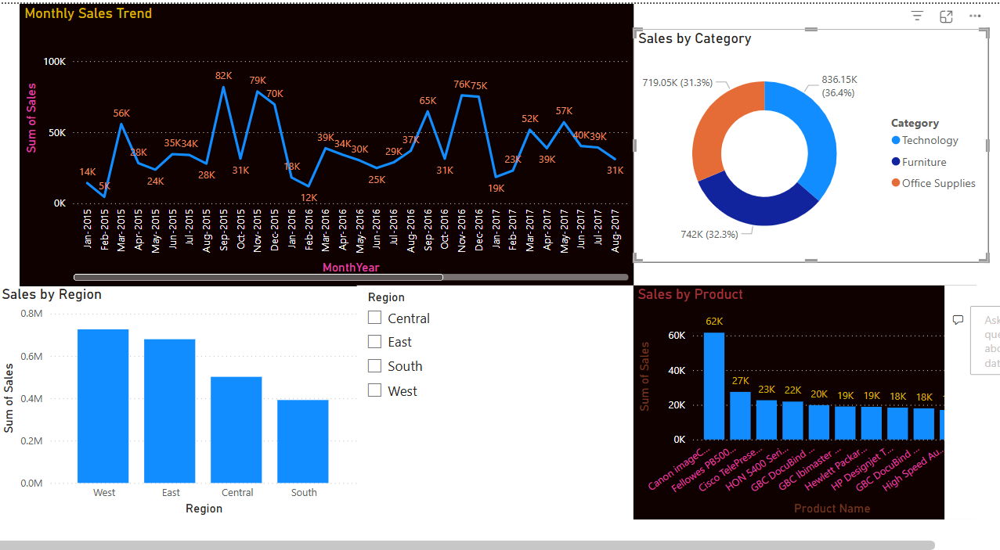

# Simple-Sales-Dashboard-Design

# 📊 Power BI Sales Dashboard – Superstore Sales Analysis

This project showcases a **Sales Dashboard** built using Power BI based on the **Superstore Sales** dataset. It highlights performance insights across products, regions, categories, and time.

---

## 🧰 Tools Used
- **Power BI** – for building the interactive dashboard
- *(Optional)* Python (Pandas) – for any preliminary data cleaning

---

## 📁 Dataset
**Superstore_Sales.csv**  
Contains columns like:
- Order Date
- Sales
- Profit
- Region
- Category
- Sub-Category
- Product Name

---

## 🎯 Objective
To design a clean, interactive dashboard that allows users to:
- Track **monthly sales trends**
- Compare **sales performance across regions**
- Understand **sales distribution by category**
- Interactively filter data using slicers

---

## 📊 Dashboard Features
- **Line Chart**: Monthly Sales Trend (`Month-Year`)
- **Bar Chart**: Sales by Region
- **Donut Chart**: Sales by Category
- **Slicer**: Filter by Region or Category
- **Color highlights** to emphasize top-performing areas

---

## 🔍 Key Insights
1. 📈 The **West** region recorded the highest total sales overall.
2. 🪙 **Technology** category contributed the most to revenue.
3. 🕒 Sales peaked during **Q4** months, especially in **November**.
4. 🧾 Top 10 products accounted for over **30%** of total sales.

---
## Screenshot of the Dashboard

## 🚀 Getting Started
1. Clone this repo.
2. Open the `.pbix` file in Power BI Desktop.
3. Load the `Superstore_Sales.csv` dataset.
4. Explore the dashboard and visuals.

---

---
